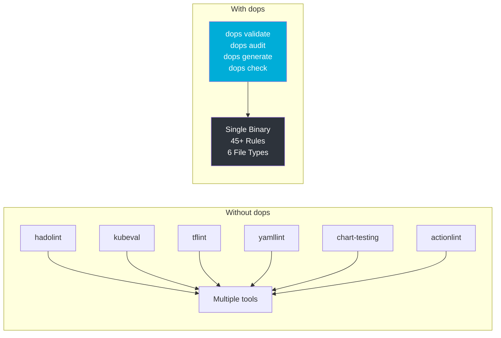
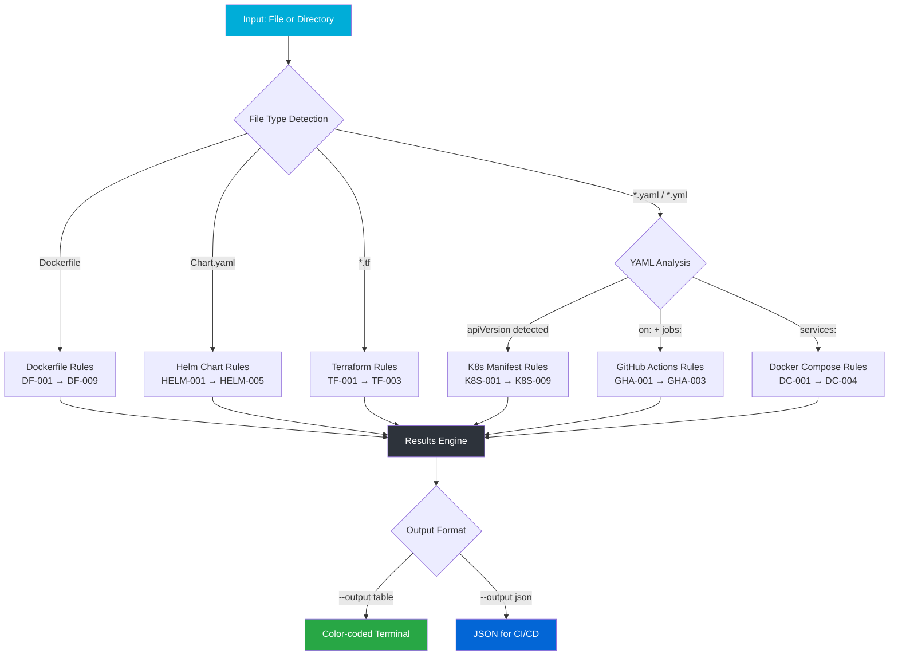
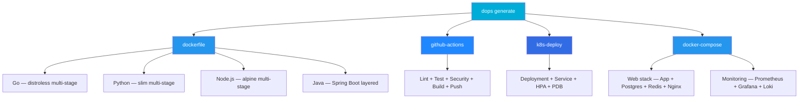
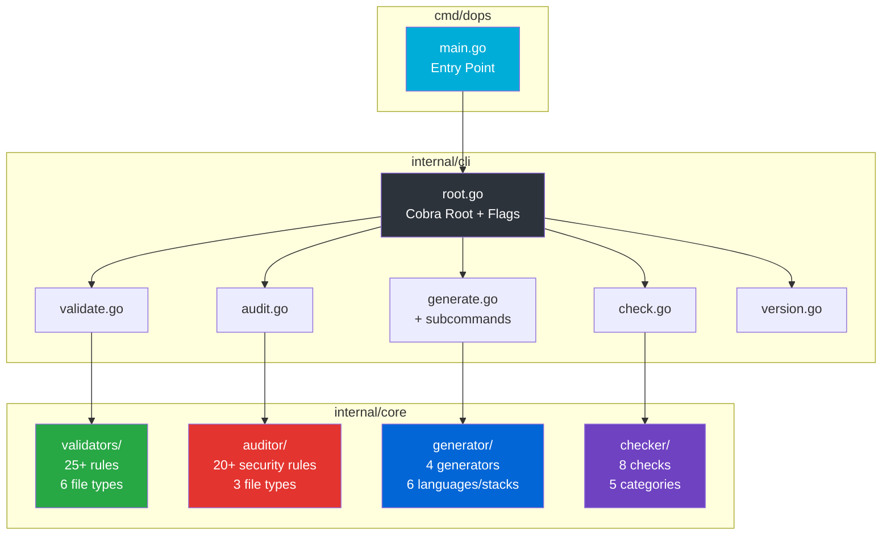

# 🛠️ dops — DevOps Swiss Army Knife

[](https://github.com/sanjaysundarmurthy/devops-cli/actions)
[](https://goreportcard.com/report/github.com/sanjaysundarmurthy/devops-cli)
[](LICENSE)
[](https://github.com/sanjaysundarmurthy/devops-cli/releases)
[](https://go.dev/)

**A fast, opinionated CLI tool that validates, audits, generates, and checks DevOps configurations from a single binary.** Built in Go for speed, portability, and zero dependencies at runtime.

```
$ dops validate ./k8s/
  ⚠ WARN   [K8S-005] k8s/deployment.yaml:14
           Container 'api' missing resource limits/requests
  ⚠ WARN   [K8S-006] k8s/deployment.yaml:14
           Container 'api' missing livenessProbe
  ✖ ERROR  [K8S-008] k8s/deployment.yaml:22
           Container 'api' is running as privileged — security risk

  Summary: 1 errors, 2 warnings, 0 info
```

---

## Why dops?

Modern DevOps teams manage configurations across Kubernetes, Docker, Terraform, Helm, and CI/CD pipelines. Catching misconfigurations before deployment prevents outages, security breaches, and compliance violations. **dops** provides a single binary that replaces a dozen linters:



## ✨ Features

| Command | Description | Rules |
|---------|-------------|-------|
| `dops validate` | Lint & validate K8s, Dockerfiles, Helm, CI configs, Compose, Terraform | **25+ rules** |
| `dops audit` | Deep security & best-practice audits with remediation guidance | **20+ rules** |
| `dops generate` | Generate production-ready configs from battle-tested templates | **4 generators** |
| `dops check` | Pre-deploy health checks (structure, secrets, YAML syntax) | **8 checks** |
| `dops version` | Print version, build info, and Go version | — |

### How It Works



### Supported File Types

| File Type | Detected By | Validation | Audit |
|-----------|-------------|:----------:|:-----:|
| **Kubernetes Manifests** | `apiVersion` + `kind` in YAML | ✅ 9 rules | ✅ 7 rules |
| **Dockerfiles** | Filename `Dockerfile` or `Dockerfile.*` | ✅ 9 rules | ✅ 4 rules |
| **Helm Charts** | `Chart.yaml` in directory | ✅ 5 rules | — |
| **GitHub Actions** | `on:` + `jobs:` in YAML | ✅ 3 rules | — |
| **Docker Compose** | `services:` key in YAML | ✅ 4 rules | — |
| **Terraform** | `.tf` file extension | ✅ 3 rules | ✅ 3 rules |

---

## 🚀 Installation

### From Source (requires Go 1.22+)
```bash
go install github.com/sanjaysundarmurthy/devops-cli/cmd/dops@latest
```

### Binary Downloads
Download pre-built binaries from [Releases](https://github.com/sanjaysundarmurthy/devops-cli/releases):

```bash
# Linux (amd64)
curl -sL https://github.com/sanjaysundarmurthy/devops-cli/releases/latest/download/dops_linux_amd64.tar.gz | tar xz
sudo mv dops /usr/local/bin/

# macOS (Apple Silicon)
curl -sL https://github.com/sanjaysundarmurthy/devops-cli/releases/latest/download/dops_darwin_arm64.tar.gz | tar xz
sudo mv dops /usr/local/bin/

# Windows (PowerShell)
Invoke-WebRequest -Uri "https://github.com/sanjaysundarmurthy/devops-cli/releases/latest/download/dops_windows_amd64.zip" -OutFile dops.zip
Expand-Archive dops.zip -DestinationPath C:\tools\
```

### Verify Installation
```bash
dops version
# dops v0.1.0 (go1.22)
```

### Build From Source
```bash
git clone https://github.com/sanjaysundarmurthy/devops-cli.git
cd devops-cli
go build -o dops ./cmd/dops/
./dops version
```

---

## 📖 Usage

### 1. Validate Configurations

**How validation works:** dops detects file types automatically and applies the appropriate rule sets. For directories, it walks recursively (skipping `.git`, `node_modules`, `.terraform`).

```bash
# Validate a single file
dops validate Dockerfile
dops validate k8s/deployment.yaml
dops validate chart/Chart.yaml

# Validate an entire directory recursively
dops validate ./infrastructure/

# JSON output for CI/CD pipelines
dops validate ./k8s/ -o json
```

**Example output:**
```
$ dops validate Dockerfile
  ⚠ WARN   [DF-001] Dockerfile:1
           Avoid using :latest tag — pin to a specific version for reproducibility
  ⚠ WARN   [DF-008] Dockerfile
           No USER instruction found — container will run as root
  ℹ INFO   [DF-009] Dockerfile
           No HEALTHCHECK instruction — add one for container orchestration

  Summary: 0 errors, 2 warnings, 1 info
```

### 2. Security Audit

**How auditing works:** Goes deeper than validation — looks for security anti-patterns like privileged containers, exposed SSH ports, hostNetwork access, missing securityContext, and Terraform misconfigurations.

```bash
# Audit a Kubernetes manifest
dops audit k8s/deployment.yaml

# Audit a Dockerfile for security issues
dops audit Dockerfile

# Audit Terraform for security gaps
dops audit main.tf

# Audit entire infrastructure directory
dops audit ./infrastructure/ -o json
```

**Example output:**
```
$ dops audit deployment.yaml
  🔴 CRIT  [SEC-K8S-006] deployment.yaml
           Container 'app' running in privileged mode
           💡 Remove privileged: true — this grants full host access

  🟡 MED   [SEC-K8S-005] deployment.yaml
           Container 'app' missing securityContext
           💡 Add securityContext with runAsNonRoot, readOnlyRootFilesystem, and capabilities drop

  🔵 LOW   [SEC-K8S-004] deployment.yaml
           Service account token auto-mounted (default behavior)
           💡 Set automountServiceAccountToken: false if API access is not needed

  Summary: 1 critical, 0 high, 1 medium, 1 low
```

### 3. Generate Configs

**How generation works:** Produces production-ready configuration files from battle-tested templates. Each template follows industry best practices including multi-stage builds, security hardening, health checks, and resource management.

```bash
# Generate a production Dockerfile (supports: go, python, node, java)
dops generate dockerfile --lang go
dops generate dockerfile --lang python --file Dockerfile

# Generate GitHub Actions CI/CD pipeline
dops generate github-actions --lang go --file .github/workflows/ci.yml

# Generate Kubernetes manifests (Deployment + Service + HPA + PDB)
dops generate k8s-deploy --name myapi --image myregistry/myapi:v1.0

# Generate Docker Compose stacks (supports: web, monitoring)
dops generate docker-compose --stack web --file docker-compose.yml
```



**Generated Dockerfile features (Go example):**
- Multi-stage build (builder → distroless runtime)
- Non-root user (`nonroot:nonroot`)
- TLS certificates and timezone data
- HEALTHCHECK instruction
- Minimal attack surface with `gcr.io/distroless/static`

### 4. Pre-Deploy Checks

**How checking works:** Validates project readiness before deployment — checks directory structure, required files, YAML syntax, .gitignore patterns, and secret file exposure.

```bash
# Run pre-deploy checks on a project
dops check ./my-project/

# Check a single file
dops check ./k8s/deployment.yaml
```

**Example output:**
```
$ dops check ./my-project/
  ✅ [required-files] (README.md) README.md found
  ❌ [required-files] (.gitignore) Repository should have .gitignore
  ✅ [yaml-syntax] All YAML files have valid syntax
  ❌ [directory-structure] (node_modules) Directory 'node_modules' should not be committed
  ❌ [secret-files] (.env) File '.env' found — ensure it's in .gitignore
  ❌ [gitignore-patterns] (.gitignore) Consider adding '*.tfstate' to .gitignore
```

**Checks performed:**

| Check | What It Does |
|-------|-------------|
| `directory-structure` | Flags `node_modules`, `.terraform`, `vendor` if committed |
| `required-files` | Verifies `README.md` and `.gitignore` exist |
| `yaml-syntax` | Validates all YAML files parse correctly |
| `gitignore-patterns` | Checks for `.env`, `*.tfstate`, `*.tfvars`, `.terraform` |
| `secret-files` | Detects `.env`, `.env.local`, `.env.production` |

---

## 🏗️ Architecture



### Project Structure

```
devops-cli/
├── cmd/dops/                    # CLI entry point
│   └── main.go                  # Binary entry, calls cli.Execute()
├── internal/
│   ├── cli/                     # Cobra command definitions
│   │   ├── root.go              # Root command, global flags (--output)
│   │   ├── validate.go          # validate command (file or directory)
│   │   ├── audit.go             # audit command (security scanning)
│   │   ├── generate.go          # generate subcommands (dockerfile, k8s, etc.)
│   │   ├── check.go             # check command (pre-deploy health)
│   │   └── version.go           # version command
│   └── core/                    # Business logic engines
│       ├── validators/          # Validation rules engine
│       │   ├── validators.go    # 25+ rules across 6 file types
│       │   └── validators_test.go
│       ├── auditor/             # Security audit engine
│       │   ├── auditor.go       # 20+ security rules with remediation
│       │   └── auditor_test.go
│       ├── generator/           # Config generation templates
│       │   ├── generator.go     # 4 generators (Dockerfile, GHA, K8s, Compose)
│       │   └── generator_test.go
│       └── checker/             # Pre-deploy checks
│           └── checker.go       # 8 checks across 5 categories
├── .github/workflows/
│   └── ci.yml                   # CI pipeline (lint, test, build, release)
├── .goreleaser.yml              # Cross-platform release automation
├── go.mod                       # Go module definition
├── .gitignore
├── LICENSE                      # MIT License
└── README.md
```

---

## 📋 Complete Rules Reference

### Dockerfile Rules (DF-001 → DF-009)

| Rule | Severity | Description | Why It Matters |
|------|----------|-------------|----------------|
| DF-001 | ⚠️ Warning | Avoid `:latest` tag | Non-reproducible builds; tag can change unexpectedly |
| DF-002 | ℹ️ Info | Prefer alpine/distroless base images | Smaller image size, reduced attack surface |
| DF-003 | ⚠️ Warning | Use `--no-install-recommends` with apt-get | Prevents installing unnecessary packages |
| DF-004 | ❌ Error | Don't pipe curl to shell (`curl \| sh`) | Remote code execution risk; download and verify first |
| DF-005 | ⚠️ Warning | Use COPY instead of ADD for local files | ADD has implicit tar extraction and URL download |
| DF-006 | ❌ Error | No hardcoded secrets in ENV | Secrets visible in image layers and `docker history` |
| DF-007 | ❌ Error | Must have FROM instruction | Invalid Dockerfile without a base image |
| DF-008 | ⚠️ Warning | Add USER instruction (non-root) | Containers run as root by default — security risk |
| DF-009 | ℹ️ Info | Add HEALTHCHECK instruction | Enables orchestrators to monitor container health |

### Kubernetes Rules (K8S-001 → K8S-009)

| Rule | Severity | Description | Why It Matters |
|------|----------|-------------|----------------|
| K8S-001 | ❌ Error | Missing `kind` field | Invalid manifest — K8s can't determine resource type |
| K8S-002 | ❌ Error | Missing `metadata` section | Required for resource identification |
| K8S-003 | ⚠️ Warning | Missing labels in metadata | Labels enable selection, organization, and tooling |
| K8S-004 | ⚠️ Warning | No namespace specified | Deploys to `default` namespace — poor isolation |
| K8S-005 | ⚠️ Warning | Missing resource limits/requests | Unbounded resource usage; can starve other pods |
| K8S-006 | ⚠️ Warning | Missing livenessProbe | K8s can't detect deadlocked containers |
| K8S-007 | ⚠️ Warning | Missing readinessProbe | Traffic sent to unready pods |
| K8S-008 | ❌ Error | Privileged container | Full host access — equivalent to root on node |
| K8S-009 | ⚠️ Warning | Using `:latest` or untagged image | Non-reproducible deployments |

### Docker Compose Rules (DC-001 → DC-004)

| Rule | Severity | Description | Why It Matters |
|------|----------|-------------|----------------|
| DC-001 | ❌ Error | Invalid YAML syntax | Compose file won't parse |
| DC-002 | ⚠️ Warning | Service missing restart policy | Service won't recover from crashes |
| DC-003 | ℹ️ Info | Service missing healthcheck | No automated health monitoring |
| DC-004 | ⚠️ Warning | Service using `:latest` tag | Non-reproducible environments |

### GitHub Actions Rules (GHA-001 → GHA-003)

| Rule | Severity | Description | Why It Matters |
|------|----------|-------------|----------------|
| GHA-001 | ⚠️ Warning | Action missing version pin | Actions can change behavior without notice |
| GHA-002 | ⚠️ Warning | Action pinned to `master` | Branch can be force-pushed; use SHA or tag |
| GHA-003 | ℹ️ Info | Job missing `timeout-minutes` | Hung workflows consume CI minutes indefinitely |

### Helm Chart Rules (HELM-001 → HELM-005)

| Rule | Severity | Description | Why It Matters |
|------|----------|-------------|----------------|
| HELM-001 | ❌ Error | Invalid Chart.yaml | Chart metadata is unparseable |
| HELM-002 | ❌ Error | Missing `version` in Chart.yaml | Required by Helm for dependency resolution |
| HELM-003 | ⚠️ Warning | Missing `appVersion` in Chart.yaml | App version tracking lost |
| HELM-004 | ❌ Error | Missing `templates/` directory | No resources to deploy |
| HELM-005 | ⚠️ Warning | Missing `values.yaml` | No default configuration |

### Terraform Rules (TF-001 → TF-003)

| Rule | Severity | Description | Why It Matters |
|------|----------|-------------|----------------|
| TF-001 | ❌ Error | Hardcoded secrets detected | Secrets in state files and version control |
| TF-002 | ⚠️ Warning | `cidr_blocks = ["0.0.0.0/0"]` | Open to the internet — restrict to specific CIDRs |
| TF-003 | ℹ️ Info | Resources without tags | No cost tracking or organizational visibility |

### Security Audit Rules (SEC-*)

| Rule | Severity | Category | Description | Remediation |
|------|----------|----------|-------------|-------------|
| SEC-K8S-001 | 🔴 Critical | K8s | hostNetwork enabled | Remove `hostNetwork: true` |
| SEC-K8S-002 | 🔴 Critical | K8s | hostPID enabled | Remove `hostPID: true` |
| SEC-K8S-003 | 🟡 Medium | K8s | Using default service account | Create dedicated SA with minimal RBAC |
| SEC-K8S-004 | 🔵 Low | K8s | SA token auto-mounted | Set `automountServiceAccountToken: false` |
| SEC-K8S-005 | 🟡 Medium | K8s | Missing securityContext | Add runAsNonRoot, readOnlyRootFilesystem |
| SEC-K8S-006 | 🔴 Critical | K8s | Privileged mode | Remove `privileged: true` |
| SEC-K8S-007 | 🟡 Medium | K8s | Writable root filesystem | Set `readOnlyRootFilesystem: true` |
| SEC-DF-001 | 🟠 High | Docker | chmod 777 detected | Use least-privilege (755 for executables) |
| SEC-DF-002 | 🟡 Medium | Docker | Running as root explicitly | Create non-root user first |
| SEC-DF-003 | 🟠 High | Docker | SSH port 22 exposed | Use `kubectl exec` or `docker exec` instead |
| SEC-DF-004 | 🟠 High | Docker | Container runs as root | Add `USER nonroot` or `USER 1000` |
| SEC-TF-001 | 🟠 High | Terraform | Publicly accessible resource | Set `publicly_accessible = false` |
| SEC-TF-002 | 🟠 High | Terraform | Encryption disabled | Enable encryption with KMS key |
| SEC-TF-003 | 🟡 Medium | Terraform | Logging disabled | Enable logging for audit trail |

---

## 🔌 CI/CD Integration

### GitHub Actions

```yaml
name: Infrastructure Validation
on: [push, pull_request]

jobs:
  validate:
    runs-on: ubuntu-latest
    steps:
      - uses: actions/checkout@v4
      - name: Install dops
        run: go install github.com/sanjaysundarmurthy/devops-cli/cmd/dops@latest
      - name: Validate configurations
        run: dops validate ./infrastructure/ -o json > validation.json
      - name: Security audit
        run: dops audit ./infrastructure/ -o json > audit.json
      - name: Pre-deploy checks
        run: dops check .
```

### Pre-commit Hook

```bash
#!/bin/sh
# .git/hooks/pre-commit
echo "Running dops validation..."
dops validate . || exit 1
echo "Running security audit..."
dops audit . || exit 1
echo "All checks passed!"
```

### GitLab CI

```yaml
validate:
  stage: test
  image: golang:1.22
  script:
    - go install github.com/sanjaysundarmurthy/devops-cli/cmd/dops@latest
    - dops validate ./k8s/
    - dops audit ./k8s/
```

---

## 🧪 Testing

```bash
# Run all tests
go test ./...

# Run tests with coverage
go test -race -coverprofile=coverage.out ./...
go tool cover -html=coverage.out

# Run specific package tests
go test ./internal/core/validators/
go test ./internal/core/auditor/
go test ./internal/core/generator/
```

---

## 🔧 Configuration

### Output Formats

| Format | Flag | Use Case |
|--------|------|----------|
| Table | `--output table` (default) | Human-readable terminal output with colors |
| JSON | `--output json` | CI/CD pipelines, programmatic processing |

### Exit Codes

| Code | Meaning |
|------|---------|
| `0` | No errors found |
| `1` | Errors detected (or command failure) |

---

## 📦 Release & Distribution

dops uses [GoReleaser](https://goreleaser.com/) for automated cross-platform builds:

| Platform | Architecture | Binary |
|----------|-------------|--------|
| Linux | amd64, arm64 | `dops_linux_amd64.tar.gz` |
| macOS | amd64, arm64 | `dops_darwin_arm64.tar.gz` |
| Windows | amd64 | `dops_windows_amd64.zip` |

Releases are triggered automatically when a Git tag is pushed:
```bash
git tag v1.0.0
git push origin v1.0.0
# GoReleaser builds and publishes binaries to GitHub Releases
```

---

## 🤝 Contributing

1. Fork the repository
2. Create your feature branch (`git checkout -b feat/amazing-feature`)
3. Run tests (`go test -race ./...`)
4. Commit your changes (`git commit -m 'feat: add amazing feature'`)
5. Push to the branch (`git push origin feat/amazing-feature`)
6. Open a Pull Request

### Development Setup

```bash
git clone https://github.com/sanjaysundarmurthy/devops-cli.git
cd devops-cli
go mod download
go build -o dops ./cmd/dops/
go test ./...
```

---

## 📄 License

MIT License — see [LICENSE](LICENSE) for details.

## 🔗 Related Projects

Part of the **DevOps Principal Mastery** toolkit:

| Project | Description |
|---------|-------------|
| [terraform-modules](https://github.com/sanjaysundarmurthy/terraform-modules) | Production-ready Azure Terraform module library |
| [docker-compose-templates](https://github.com/sanjaysundarmurthy/docker-compose-templates) | Ready-to-use Docker Compose environments |
| [helm-charts](https://github.com/sanjaysundarmurthy/helm-charts) | Production-ready Kubernetes Helm charts |
